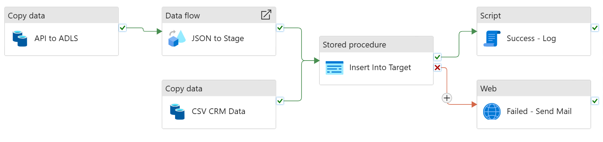

# Question 1 – Company Activity Pipeline & Data Model

## Overview
This repository contains the proposed data model and Azure Data Factory pipeline design for the Company Activity dashboard, including table structure, SQL logic, API ingestion approach, and operational decisions.

---

## 1. Target Analytics Table

**Table Name:** company_activity_daily  
**Grain:** One row per company per day  

**Columns:**
- company_id  
- activity_date  
- company_name  
- country  
- industry_tag  
- last_contact_at  
- active_users  
- events  
- rolling_7d_active_users (derived)  
- rolling_7d_events (derived)  
- activity_status (derived)  
- load_datetime  

---

## 2. Sample SQL to Populate the Table

**Assumptions:**
- stg_crm_data (from CSV)  
- stg_product_usage (from API)  

```sql
INSERT INTO company_activity_daily (
    company_id,
    activity_date,
    company_name,
    country,
    industry_tag,
    last_contact_at,
    active_users,
    events,
    rolling_7d_active_users,
    rolling_7d_events,
    activity_status,
    load_datetime
)
SELECT
    c.company_id,
    p.date AS activity_date,
    c.name AS company_name,
    c.country,
    c.industry_tag,
    c.last_contact_at,
    p.active_users,
    p.events,

    SUM(p.active_users) OVER (
        PARTITION BY c.company_id
        ORDER BY p.date
        ROWS BETWEEN 6 PRECEDING AND CURRENT ROW
    ) AS rolling_7d_active_users,

    SUM(p.events) OVER (
        PARTITION BY c.company_id
        ORDER BY p.date
        ROWS BETWEEN 6 PRECEDING AND CURRENT ROW
    ) AS rolling_7d_events,

    CASE 
        WHEN p.active_users >= 80 THEN 'High'
        WHEN p.active_users >= 50 THEN 'Medium'
        ELSE 'Low'
    END AS activity_status,

    GETDATE() AS load_datetime
FROM stg_product_usage p
LEFT JOIN stg_crm_data c 
    ON p.company_id = c.company_id
WHERE p.date IS NOT NULL
  AND p.company_id IS NOT NULL
  AND NOT EXISTS (
      SELECT 1
      FROM company_activity_daily cad
      WHERE cad.company_id = p.company_id
        AND cad.activity_date = p.date
  );
```

---

## 3. Azure Data Factory Flow

API ingestion is placed at the very beginning and runs in parallel with the CRM CSV load to optimise runtime.

**Flow Overview:**
- Trigger (Scheduled)
- Parallel Execution:
  - Load CRM CSV → stg_crm_data  
  - Call Product Usage API → Blob → stg_product_usage  
- Data Transformation  
- Insert into company_activity_daily  
- Failure alert via Web Activity (Email / Teams)

### ADF Pipeline Flow Diagram


---

## 4. Python-Style Pseudocode for API Ingestion

```python
def fetch_product_usage(start_date, end_date):
    api_url = "https://api.company.com/product-usage"

    for date in daterange(start_date, end_date):
        response = http_get(
            api_url,
            params={"date": date}
        )

        if response.status_code != 200:
            raise Exception(f"API failure for {date}")

        data = response.json()
        timestamp = get_utc_timestamp_iso()
        blob_path = f"files/api/product_usage_{timestamp}.json"

        upload_to_blob(blob_path, data)
        insert_into_staging(data, table="stg_product_usage")
```

---

## 5. 30-Minute Priority Decision

I would focus on a quick-win approach — a bird in hand is better than ten on the tree.

The CRM CSV ingestion would be implemented first because it is predictable, straightforward, and can be completed and validated within the 30-minute window, ensuring at least one reliable data source is available for the next run.

The API integration would be explicitly postponed as it requires additional time for testing, error handling, authentication validation, and response structure verification. Rushing it could introduce instability into the pipeline.
